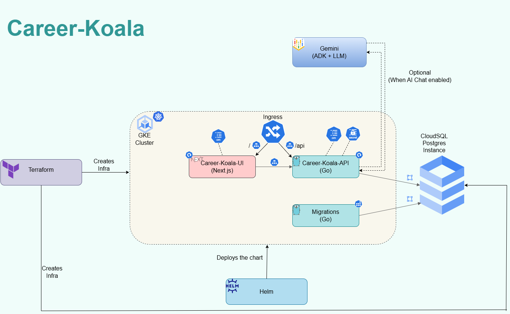

# CareerKoala (Go API + Next.js UI + Helm)

Single-user career coach with 4 domain agents (Jobs, Coding, Projects, Networking). Go backend + Postgres, Next.js UI, and Helm deployment.

## Layout
- `go/`: Go API server
  - `go/main.go`: HTTP API server
  - `go/agents/`: ADK agents and routing
  - `go/db/`: Postgres access and helpers
  - `go/cmd/migrate/`: migrations runner (`go run ./cmd/migrate up`)
  - `go/migrations/`: goose SQL migrations + embedded FS
- `ui/`: Next.js UI
- `helm/career-koala/`: Helm chart (API, UI, Postgres dependency, migrations job)
- `kind/`: kind values + deploy script
- `gcp/`: GCP values + deploy script
- `terraform/`: GKE + Cloud SQL (private IP)

## Architecture diagram


## Prereqs
- Docker
- Helm
- kubectl
- kind (for local k8s testing)
- Go 1.24+ (only if running locally outside k8s)

## Environment variables
The API reads these (in order):
1) `DATABASE_URL`
2) `POSTGRES_DATABASE_URL`
3) `POSTGRES_HOST`, `POSTGRES_PORT`, `POSTGRES_USER`, `POSTGRES_PASSWORD`, `POSTGRES_DB`, `POSTGRES_SSLMODE`

AI settings:
- `ENABLE_AI` (default false)
- `MODEL_NAME` (Vertex model path or alias)
- `GOOGLE_CLOUD_PROJECT`
- `VERTEX_LOCATION`
- `VALIDATE_MODEL` (default true)

Migrations:
- `RUN_MIGRATIONS` (default false; API does not run migrations by default)

## Build images
### Kind (local k8s) image names
These match `kind/values.yaml`:
```bash
# API
docker build -t "${CR}/${CR_PROJECT}/${CR_IMAGE_API}:${CR_IMAGE_TAG}" -f go/Dockerfile go

# Migrations
docker build -t "${CR}/${CR_PROJECT}/${CR_IMAGE_MIGRATE}:${CR_IMAGE_TAG}" -f go/migrations/Dockerfile go

# UI
docker build -t "${CR}/${CR_PROJECT}/${CR_IMAGE_UI}:${CR_IMAGE_TAG}" -f ui/Dockerfile ui
```

Load into kind:
```bash
kind load docker-image "${CR}/${CR_PROJECT}/${CR_IMAGE_API}:${CR_IMAGE_TAG}"
kind load docker-image "${CR}/${CR_PROJECT}/${CR_IMAGE_MIGRATE}:${CR_IMAGE_TAG}"
kind load docker-image "${CR}/${CR_PROJECT}/${CR_IMAGE_UI}:${CR_IMAGE_TAG}"
```

### GCP Artifact Registry image names
These match `gcp/values.yaml`:
```bash
# API
docker build -t "${GCR}/${GCR_PROJECT}/${GCR_IMAGE_API}:${GCR_IMAGE_TAG}" -f go/Dockerfile go

# Migrations
docker build -t "${GCR}/${GCR_PROJECT}/${GCR_IMAGE_MIGRATE}:${GCR_IMAGE_TAG}" -f go/migrations/Dockerfile go

# UI
docker build -t "${GCR}/${GCR_PROJECT}/${GCR_IMAGE_UI}:${GCR_IMAGE_TAG}" -f ui/Dockerfile ui
```
Push images:
```bash
docker push "${GCR}/${GCR_PROJECT}/${GCR_IMAGE_API}:${GCR_IMAGE_TAG}"
docker push "${GCR}/${GCR_PROJECT}/${GCR_IMAGE_MIGRATE}:${GCR_IMAGE_TAG}"
docker push "${GCR}/${GCR_PROJECT}/${GCR_IMAGE_UI}:${GCR_IMAGE_TAG}"
```

## Deploy to kind (local k8s)
```bash
# ensure context
kubectl config use-context kind-kind
kubectl config set-context --current --namespace=career-koala

# deploy
cd kind
./deploy.sh
```

Port-forward:
```bash
kubectl -n career-koala port-forward svc/career-koala-api 8080:8080
kubectl -n career-koala port-forward svc/career-koala-ui 3000:80
```
Open:
- API: http://localhost:8080/meta
- UI: http://localhost:3000

## Deploy to GCP (GKE)
1) Update `gcp/values.yaml`:
   - image repos/tags
   - DB host/user/password
   - ingress host
   - `GOOGLE_CLOUD_PROJECT`

2) Deploy:
```bash
cd gcp
./deploy.sh
```

## Terraform (GKE + Cloud SQL)
```bash
cd terraform
terraform init
terraform apply \
  -var="project_id=$GOOGLE_CLOUD_PROJECT" \
  -var="region=$GCP_REGION" \
  -var="zone=$GCP_ZONE" \
  -var="cloudsql_password=CHANGE_ME"
```

Destroy (two-phase):
```bash
gcp/terraform-destroy.sh
```

Manual equivalent:
```bash
terraform -chdir=terraform apply -var enable_cloudsql=false
terraform -chdir=terraform destroy
```

Get credentials:
```bash
gcloud container clusters get-credentials $GKE_CLUSTER_NAME --region us-central1 --project $GOOGLE_CLOUD_PROJECT
```

## Migrations
- Migrations run via Helm job (`migrations-job.yaml`).
- API does NOT auto-run migrations unless `RUN_MIGRATIONS=true`.

Manual run (local):
```bash
go run ./go/cmd/migrate up
```

Debug job (manual apply):
```bash
kubectl apply -f helm/career-koala/templates/migration-debug.yaml
kubectl logs -n career-koala job/career-koala-migrations-debug
```

## Debug commands
### Helm
```bash
helm get values career-koala -n career-koala
helm get manifest career-koala -n career-koala | grep -n "image"
```

### Kubernetes
```bash
kubectl get pods -n career-koala
kubectl get svc -n career-koala
kubectl get jobs -n career-koala
kubectl logs -n career-koala job/<job-name>
kubectl describe job -n career-koala <job-name>
kubectl get events -n career-koala --sort-by=.lastTimestamp
```

### Kind image list
```bash
kind get nodes --name kind
# usually: kind-kind-control-plane

docker exec -it kind-kind-control-plane ctr -n k8s.io images ls -q
```

### Base64 decode secret
```bash
echo -n "BASE64STRING" | base64 --decode
```

## Notes
- Startup order is enforced via init containers:
  - migrations wait for Postgres
  - API waits for Postgres + migrations
  - UI waits for API
- If migrations are disabled, set `api.waitForMigrations=false` in values.
